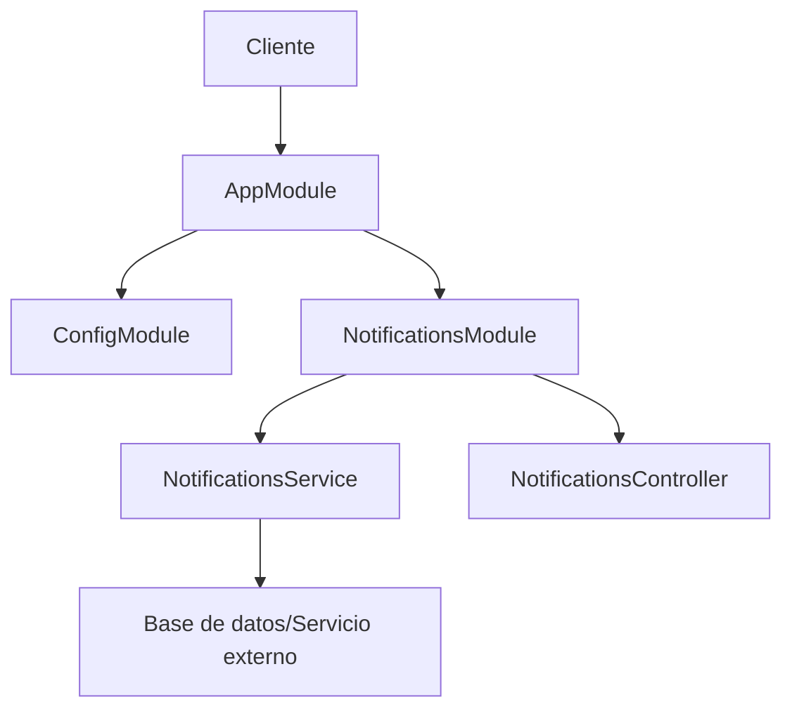

# Documentación del Proyecto

## 1. Resumen de la Pila Técnica

- **NestJS**: Framework de backend elegido por su arquitectura modular y soporte nativo para TypeScript.
- **TypeScript**: Lenguaje principal, seleccionado por su tipado estático y mejoras en la mantenibilidad del código.
- **Jest**: Framework de pruebas utilizado para pruebas unitarias y de integración.
- **class-validator**: Biblioteca para validación de DTOs, elegida por su integración con NestJS y decoradores.
- **dotenv**: Para gestión de variables de entorno, facilitando la configuración en diferentes entornos.

Estas tecnologías fueron elegidas por su robustez, tipado fuerte y buena integración con el ecosistema de NestJS, lo que permite un desarrollo más seguro y mantenible.

## 2. Arquitectura de Alto Nivel

El proyecto sigue una arquitectura modular basada en NestJS, con una clara separación de responsabilidades:

El sistema se compone de módulos independientes, cada uno con sus propios controladores y servicios. La configuración se gestiona de manera centralizada, y los servicios de notificación están diseñados para ser fácilmente intercambiables.

## 3. Lista de Componentes

### AppModule
- **Descripción**: Módulo principal de la aplicación.
- **Responsabilidades**: Configuración global y orquestación de otros módulos.
- **Interfaces**: Importa y configura otros módulos.

### ConfigModule
- **Descripción**: Gestiona la configuración de la aplicación.
- **Responsabilidades**: Carga y proporciona acceso a variables de entorno.
- **Interfaces**: Expone `ConfigService` para acceder a la configuración.

### NotificationsModule
- **Descripción**: Maneja la lógica de notificaciones.
- **Responsabilidades**: Envío y gestión de notificaciones.
- **Interfaces**: Expone `NotificationsController` para endpoints de API.
- **Dependencias**: Utiliza `NotificationsService` o `NotificationsFakeService`.

### NotificationsService / NotificationsFakeService
- **Descripción**: Implementa la lógica de negocio para notificaciones.
- **Responsabilidades**: Procesamiento y envío de notificaciones.
- **Interfaces**: Métodos para enviar diferentes tipos de notificaciones.

## 4. Configuración e Instalación

1. Clonar el repositorio.
2. Instalar dependencias: `npm install`
3. Copiar `.env.example` a `.env.local` y configurar las variables de entorno.
4. Ejecutar en modo desarrollo: `npm run start:dev`

## 5. Construcción y Despliegue

- **Construcción**: Ejecutar `npm run build` para compilar el proyecto.
- **Despliegue**: 
  1. Construir la aplicación
  2. Configurar variables de entorno en el servidor
  3. Iniciar la aplicación con `npm run start:prod`

No se proporciona información sobre CI/CD en los archivos dados.

## 6. Estrategia de Pruebas

- Se utilizan pruebas unitarias con Jest.
- Para ejecutar las pruebas: `npm run test`
- Para cobertura: `npm run test:cov`

No se proporcionan detalles sobre pruebas de integración o e2e en los archivos dados.

## 7. Decisiones de Diseño Clave y Compensaciones

- **Servicios Intercambiables**: Se utiliza inyección de dependencias para permitir fácil intercambio entre servicios reales y falsos (mock).
- **Configuración Centralizada**: Uso de `ConfigModule` para gestionar la configuración, facilitando cambios entre entornos.
- **Modularidad**: Estructura del proyecto diseñada para escalar fácilmente con nuevos módulos.

## 8. Mejoras Futuras

- Implementar pruebas de integración y e2e.
- Mejorar la documentación de la API (posiblemente con Swagger).
- Considerar la implementación de un sistema de logging más robusto.
- Evaluar la necesidad de un sistema de caché para optimizar el rendimiento.

Esta documentación se ha generado basándose en la estructura y contenido de los archivos proporcionados. Algunas secciones podrían beneficiarse de información adicional no presente en los archivos dados.